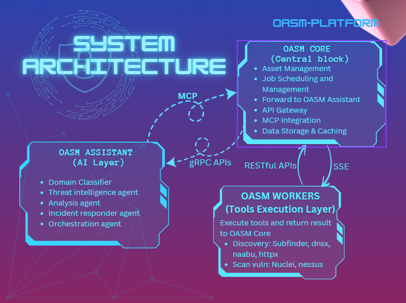

# 🤖 OASM ASSISTANT

**AI-Powered External Attack Surface Management**

[](https://oasm.dev)
[](https://opensource.org/licenses/MIT)
[](https://www.python.org/downloads/)

---

## Overview

OASM Assistant is an AI-powered security platform that automates external attack surface management using multi-agent architecture with LangGraph.

### Key Features

- 🤖 **Multi-Agent AI System** - Specialized agents for security tasks
  - **Threat Intelligence Agent** - IOC correlation, attack prediction, threat monitoring
  - **Analysis Agent** - Vulnerability assessment, compliance checking (OWASP, CWE, PCI-DSS, ISO 27001, etc)
  - **Incident Responder Agent** - Attack detection, automated response, forensic analysis
  - **Orchestrator Agent** - Workflow coordination, natural language interface
- 🔍 **Threat Intelligence** - Real-time monitoring and analysis
- 🛡️ **Vulnerability Management** - Automated scanning and prioritization
- 📊 **Compliance Checking** - OWASP, CWE, PCI-DSS, ISO 27001, etc
- ⚡ **Incident Response** - Automated detection and response
- 🔧 **Utility Tools** - Domain Classifier, Nuclei Template Generator, Issue Resolver

---

## Quick Start

```bash
# Clone repository
git clone https://github.com/your-org/oasm-assistant.git
cd oasm-assistant

# Configure
cp .env.example .env
nano .env  # Edit: POSTGRES_PASSWORD, LLM_PROVIDER

# Start services
docker compose up -d

# Pull LLM model (if using Ollama)
docker compose exec oasm-assistant-ollama ollama pull qwen2.5:7b
```

📖 **[Detailed Installation Guide](docs/INSTALLATION.md)**

---

## Architecture



### 🤖 OASM ASSISTANT (AI Layer)

**Intelligent automation layer** built on top of [OASM Platform](https://github.com/oasm-platform)

**Components:**

- **Multi-Agent System** - Threat Intel • Analysis • Incident Response • Orchestrator
- **LLM Providers** - Local (Ollama, vLLM, SGLang) • Cloud (OpenAI, Claude, Gemini)
- **AI Tools** - RAG System (pgvector) • SearXNG • Domain Classifier • Nuclei Generator • Issue Resolver

**Integration:**

- **gRPC** - High-performance communication with Core API
- **MCP Protocol** - Real-time asset context and knowledge retrieval
- **PostgreSQL** - Vector search for RAG (Retrieval Augmented Generation)

### ⚙️ OASM CORE (Management Platform)

**Central platform** for external attack surface management → [View Core Platform](https://github.com/oasm-platform/open-asm)

**Components:**

- **Web Console** - Management dashboard
- **Core API & MCP Server** - REST, gRPC, MCP protocols
- **Database** - PostgreSQL, Redis, Kafka
- **Distributed Workers** - Security scanning execution

**External Resources:**

- **Internet/Attack Surface** - Target systems
- **Knowledge Base** - Nuclei Templates, OWASP, MITRE ATT&CK, etc

---

## Documentation

### 📚 Getting Started

- **[Installation Guide](docs/INSTALLATION.md)** - Docker setup, GPU configuration
- **[Configuration Guide](docs/CONFIGURATION.md)** - Environment variables, provider setup
- **[LLM Deployment](docs/LLM_DEPLOYMENT.md)** - Complete LLM & embedding setup

### 🔧 Advanced

- Architecture (coming soon)
- API Reference (coming soon)
- Development Guide (coming soon)

---

## Technology Stack

- **AI Framework**: LangGraph, LangChain
- **LLM Providers**: Ollama, vLLM, SGLang, OpenAI, Anthropic, Google
- **RAG**: pgvector (vector search), BM25 (keyword search)
- **Communication**: gRPC, MCP (Model Context Protocol)
- **Storage**: PostgreSQL with pgvector extension

---

## License

MIT License - see [LICENSE](LICENSE) file.

---

## Disclaimer

**For defensive security only.** Use only on systems you own or have permission to test.

---

**Built by Team OASM-Platform** • [Documentation](docs/) • [Issues](https://github.com/your-org/oasm-assistant/issues)
